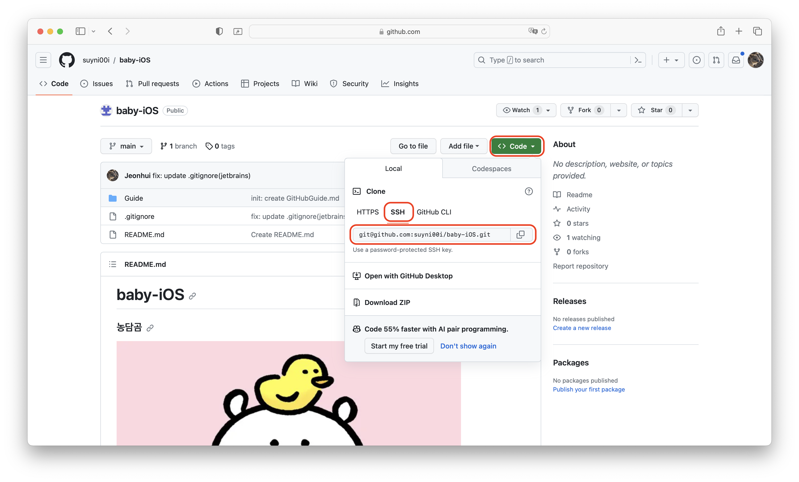

# GitHub

---
## Command
<details>
<summary> 자세히 보기</summary>

## 원격저장소에서 로컬로 가져오기
- 원격 저장소: GitHub 홈페이지에서 만들었던 레포지토리
- 로컬: 내 노트북  

```shell
git clone {원격저장소 주소}
```
{} 안에 들어있는 건 따로 복사해서 사용하는 것입니다. {}도 넣어야하는 거 X


### 원격 저장소 주소 확인 (둘 중 하나 선택)
**http 방식**  

**ssh 방식**


---

**중간 과정은 나중에 추가해 드릴게요. (까먹음 이슈)**

---

### 새로 만든 파일 및 수정 사항 스테이지 영역(원격저장소에 올리기 전 영역)에 올리기
- 원하는 파일만 저장소로 올릴 수 있음
```shell
git add .
```

특정 파일만 올리는 방법
```shell
git add {특정 파일 경로}
```

### Commit (자신의 수정 사항이나 새로운 사항을 원격 저장소에 올리기 전 체크포인트?)
```shell
git commit -m "{자신이 적을 커밋 메세지}"
```

### Push (커밋 사항을 원격 저장소에 올리기)
```shell
git push
```

</details>
